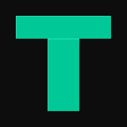

<div align="center">



# ttweaks

**Портативный оверлей для OBS: зрители тратят Channel Points —**  
**на стриме появляются видео, мемы и музыка из Яндекс Музыки.**

[](https://github.com/olesgrits-hue/ttv_points/actions/workflows/release.yml)
[](https://github.com/olesgrits-hue/ttv_points/releases/latest)
[](https://github.com/olesgrits-hue/ttv_points/releases/latest)

<br/>

### [⬇ Скачать ttweaks.exe](https://github.com/olesgrits-hue/ttv_points/releases/latest)

*Portable — ничего устанавливать не нужно. Просто запусти рядом с OBS.*

</div>

---

## Как это работает

```
Зритель тратит Channel Points
         │
         ▼
   ttweaks слушает Twitch EventSub
         │
         ├─► Медиафайл → видео / GIF / аудио в OBS Browser Source
         ├─► Мем       → случайный файл из папки
         └─► Музыка    → трек из Яндекс Музыки + анимация пластинки
```

---

## Возможности

| | Тип | Что происходит |
|---|---|---|
| 🎬 | **Медиафайл** | Воспроизводит видео, GIF или аудиофайл поверх стрима |
| 🃏 | **Мем** | Берёт случайный файл из указанной папки |
| 🎵 | **Яндекс Музыка** | Зритель пишет название — играет трек с vinyl-анимацией |

**Дополнительно:**

- 🗂 **Группы оверлеев** — несколько независимых Browser Source (отдельные для музыки, мемов и т.д.)
- ⚡ **Параллельные очереди** — музыка играет одновременно с медиа, не ждёт своей очереди
- 🎛 **Очередь / Skip** — вкладка с текущим воспроизведением, кнопка пропустить, очистить очередь
- 🔊 **Авто-нормализация** — Web Audio API компрессор выравнивает громкость всех треков
- 📐 **Кастомный размер** — задай ширину и высоту оверлея для каждого слота отдельно
- 📋 **Лог событий** — все активации с результатом в реальном времени
- 🔄 **Авто-обновление** — приложение само проверяет новые версии и предлагает обновиться
- 🐛 **Баг-репорт** — одна кнопка создаёт Issue с логами прямо на GitHub

---

## Быстрый старт

### 1. Скачай и запусти

**[Скачать ttweaks.exe →](https://github.com/olesgrits-hue/ttv_points/releases/latest)**

Положи файл в любую папку, запусти. При первом запуске откроется онбординг — он проведёт по всем шагам.

### 2. Войди в Twitch

Нажми **"Войти через Twitch"** — откроется браузер. Войди в аккаунт стримера.

### 3. Добавь Browser Source в OBS

Источник → **Browser Source**, URL:

```
http://127.0.0.1:7891/overlay/default
```

Рекомендуемые настройки: **1920 × 1080**, отключи *"Shutdown source when not visible"* и *"Refresh browser when scene becomes active"*.

### 4. Создай слот

Вкладка **СЛОТЫ** → **"+ добавить слот"** → выбери тип → привяжи Channel Points reward или создай новый прямо из приложения.

### 5. Яндекс Музыка *(опционально)*

Вкладка **НАСТРОЙКИ** → **"Войти через Яндекс"** → введи код на `ya.ru/device`.

---

## Типы медиафайлов

| Тип | Расширения |
|---|---|
| Видео | `.mp4` `.webm` `.gif` |
| Изображение | `.png` `.jpg` `.jpeg` |
| Аудио | `.mp3` `.wav` `.ogg` `.aac` `.flac` `.m4a` |

Аудиофайлы воспроизводятся без визуала — только звук через оверлей.

---

## Несколько оверлеев

Нужны отдельные Browser Source для разных типов контента?

1. Создай группу в разделе **СЛОТЫ**
2. Назначь слоты в эту группу
3. Добавь второй источник в OBS: `http://127.0.0.1:7891/overlay/{название-группы}`

---

## Требования

- Windows 10/11 x64
- Twitch-аккаунт с правами на Channel Points
- OBS Studio (или любой браузерный источник)

---

## Разработка

```bash
git clone https://github.com/olesgrits-hue/ttv_points.git
cd ttv_points
npm install
npm run dev        # dev-сервер
npm run build      # → release/ttweaks.exe
```

---

## Нашёл баг?

Вкладка **ЛОГИ** → **"Отправить баг-репорт"** — автоматически создаёт issue с последними логами.

Или вручную: [открыть Issue](https://github.com/olesgrits-hue/ttv_points/issues/new/choose)

---

<div align="center">

Сделано для [twitch.tv/scler0ze](https://twitch.tv/scler0ze) &nbsp;·&nbsp; [Поддержать стримера ❤](https://dalink.to/scler0se)

</div>
